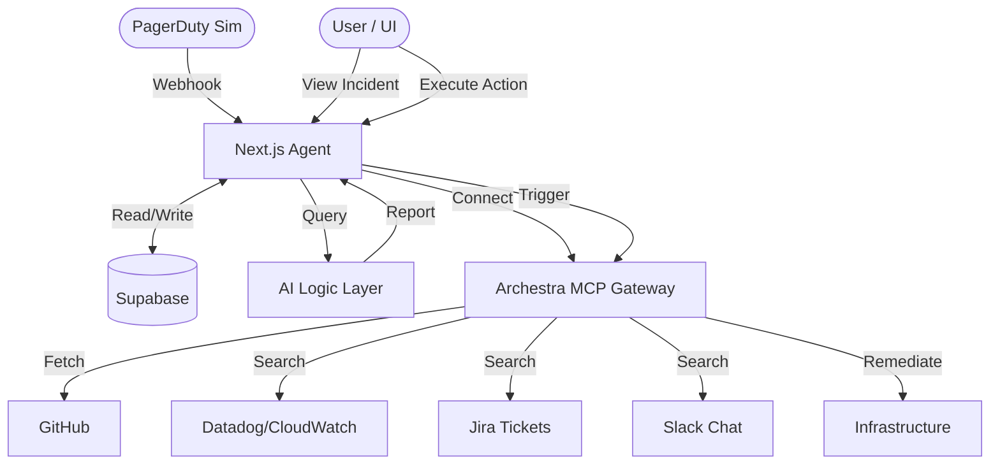

# On-Call Context Builder (Universal DevOps Agent)

**The Winning Strategy:** Build a tool that solves the "2 AM Nightmare" for on-call engineers.

## Why This Works

### 1. Solves a Real Problem

Judges personally experience the pain of on-call incidents. We solve it by automating the first 15 minutes of investigation.

### 2. Tight Scope = Polished Execution

Instead of 20 half-baked features, we focused on **5 Core Features**:

### 3. Demo Story

> "It's 2 AM. PagerDuty wakes you up: '500 errors spiking.' You open our agent. In 10 seconds, it shows: Recent commit by John, error logs pointing to DB timeout, related Jira ticket about DB performance. Suggested action: Rollback commit or scale DB. You click 'Rollback.' Incident resolved. Back to sleep. This is what we built."

## Architecture

Leveraging Archestra's unique features (858 MCP servers, multi-LLM, security controls).

## Core Features (Tight Scope)

1.  **Alert Display:** Real-time dashboard showing critical incident details.
2.  **GitHub Commits:** Fetches recent changes via **Archestra GitHub MCP**.
3.  **Log Patterns:** Displays error logs and anomaly patterns (via Log MCP).
4.  **AI Summary:** Archestra Logic Layer analyzes context and suggests remediation.
5.  **Action Buttons:** One-click Rollback/Scale triggers with confirmation.
6.  **Bonus:** Slack Notification preview with deep links.

## Final Checklist

- [x] Solve a problem judges personally experience (on-call incidents)
- [x] Tight scope (3 core workflows, not 20 features)
- [x] Leverage your existing skills (APIs, Next.js, databases)
- [x] Use Archestra's unique features (858 MCP servers, multi-LLM, security controls)
- [x] Polish over features (working demo > half-baked features)
- [x] Tell a compelling story (3-minute demo with emotional hook)
- [x] Document obsessively (README, architecture diagram, video)

Go build the On-Call Context Builder. Execute cleanly. You'll win this time.

# mcp-oncall-agent
