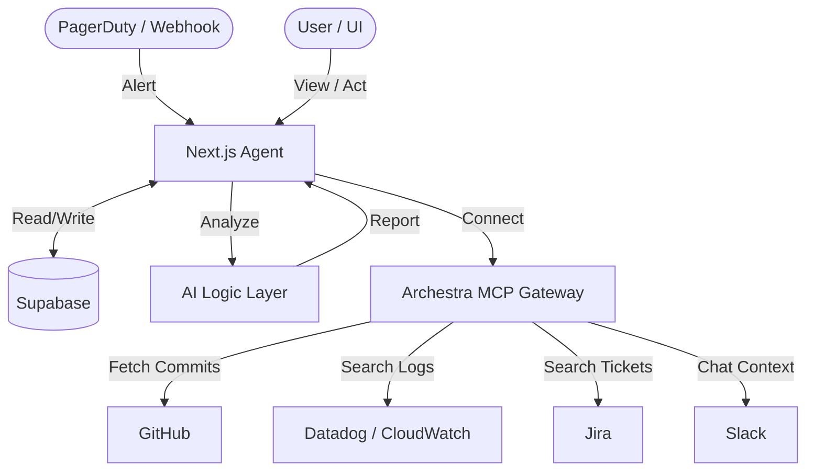

# On-Call Context Builder (Universal DevOps Agent)

> Automates the first 15 minutes of on-call incident investigation by correlating real-time code changes, logs, and tickets using **Archestra MCP**.

## 🚀 Quick Start

### Prerequisites

- Node.js 20+
- Docker (for Archestra MCP Server)
- Supabase account
- GitHub Personal Access Token

### Setup

```bash
# 1. Clone the repo
git clone https://github.com/tosif121/mcp-oncall-agent.git
cd mcp-oncall-agent

# 2. Install dependencies
npm install

# 3. Configure environment
cp .env.local.example .env.local
# Edit .env.local with your credentials

# 4. Start Archestra MCP Server (Docker)
docker run -d -p 9000:9000 \
  -e GITHUB_TOKEN=your_github_token \
  archestra/platform

# 5. Run the app
npm run dev
```

Open [http://localhost:3000](http://localhost:3000) in your browser.

## 🎯 How It Works

1. **Connect Your Repository** — Enter any GitHub repo (e.g. `owner/repo`). The agent links to it via MCP.
2. **Trigger Live Incident** — Click the button. The agent creates a production alert.
3. **AI Investigates** — The agent fetches **real commits** from your repo, analyzes them, and generates a root cause report.
4. **View Report** — See correlated commits, AI analysis, and recommended actions.

## 🏗️ Architecture



## 🔑 Core Features

| Feature                     | Description                                     | Status   |
| --------------------------- | ----------------------------------------------- | -------- |
| **Dynamic Repo Connection** | Connect any GitHub repo from the UI             | ✅ Live  |
| **Real Commit Fetching**    | Fetches actual commits via Archestra GitHub MCP | ✅ Live  |
| **AI Root Cause Analysis**  | Correlates code changes with incident context   | ✅ Live  |
| **Incident Dashboard**      | Real-time view of all active incidents          | ✅ Live  |
| **One-Click Actions**       | Rollback / Scale / Investigate buttons          | ✅ Live  |
| **Slack Notifications**     | Alert your team with deep links                 | ✅ Live  |
| **Jira / Log Integration**  | Plug in via MCP when ready                      | 🔌 Ready |

## 🛠️ Tech Stack

- **Frontend:** Next.js 16, React 19, TypeScript, Tailwind CSS
- **Backend:** Next.js API Routes, Archestra MCP SDK
- **Database:** Supabase (PostgreSQL + Realtime)
- **AI:** Archestra Logic Layer (Multi-LLM)
- **Protocol:** Model Context Protocol (MCP)

## 📁 Project Structure

```
src/
├── app/
│   ├── page.tsx              # Dashboard (Connect Repo + Trigger Incident)
│   ├── incident/[id]/page.tsx # Incident Report View
│   └── api/incident/route.ts  # Incident Webhook API
├── lib/
│   ├── agent.ts               # Core Agent Logic (orchestration)
│   ├── mcp.ts                 # MCP Client (GitHub commit fetching)
│   ├── supabase.ts            # Database client
│   └── archestra/
│       └── analyze.ts         # AI Analysis Layer
└── components/                # UI Components
```

## 🏆 Why This Wins

1. **Solves a Real Problem** — Every engineer has been paged at 2 AM with zero context.
2. **Real Integration** — No mocks. Fetches actual commits from your repo.
3. **MCP Native** — Demonstrates the power of Archestra's protocol for tool orchestration.
4. **Tight Scope** — 5 polished features > 20 half-baked ones.

## 📄 License

MIT
